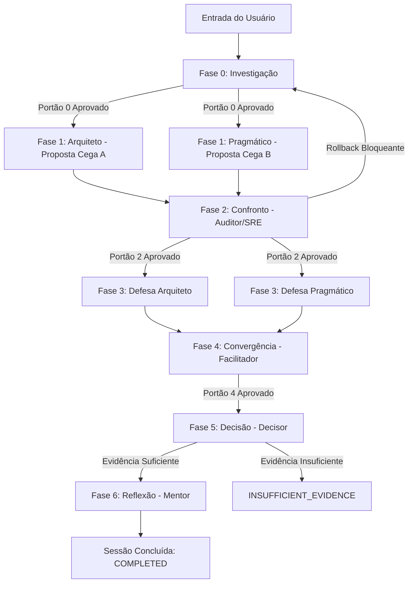

# Protocolo de Deliberação do Comitê — AI Committee

Este documento formaliza o protocolo operacional que rege o ciclo de deliberação do **AI Committee**. O processo é modelado como uma máquina determinística de deliberação estruturada de 7 fases (Fases 0 a 6).

---

## 1. Visão Geral do Ciclo Deliberativo

O fluxo de deliberação obedece a uma progressão estrita de portais de qualidade (*quality gates*). Os agentes não interagem em conversação livre; cada fase possui papéis autorizados, contexto delimitado e artefatos de saída canônicos.

---

## 2. As 7 Fases Obrigatórias

### FASE 0 — INVESTIGAÇÃO (Clarification & Framing)
* **Objetivo**: Desconstruir o problema bruto, isolando a verdade verificável das suposições e identificando lacunas críticas.
* **Papéis Ativos**: Facilitador e Usuário Humano.
* **Entradas**: Mensagem inicial e respostas do usuário.
* **Saída Mínima Canônica**:
  - `ProblemContext` contendo:
    - `summary`: Resumo executivo do problema;
    - `facts`: Fatos comprovados e dados do ambiente;
    - `constraints`: Restrições duras (orçamento, prazos, tecnologias obrigatórias);
    - `assumptions`: Premissas e hipóteses provisórias adotadas;
    - `unknowns`: Incógnitas identificadas e seus riscos;
    - `open_questions`: Dúvidas formuladas para o usuário;
    - `success_criteria`: Critérios objetivos para medição de sucesso.
* **Regra de Interrupção**: Se houver informações críticas ausentes, o sistema transiciona para `WAITING_FOR_USER` até que o usuário responda. O avanço não ocorre por suposição não validada.
* **Portão de Saída (Gate 0)**: `open_questions == 0` e `ProblemContext` validado e congelado em versão v1 (imutável).

---

### FASE 1 — DIVERGÊNCIA CEGA (Blind Divergence)
* **Objetivo**: Explorar o espaço de soluções a partir de duas perspectivas extremas e complementares (sustentabilidade/escala vs simplicidade/velocidade).
* **Papéis Ativos**: Arquiteto e Pragmático.
* **Regra de Isolamento Mútuo**:
  - Ambos recebem exclusivamente o `ProblemContext` v1.
  - Nenhum tem acesso à proposta, raciocínio, custos ou rascunhos do outro durante esta fase.
* **Saídas Mínimas Canônicas**:
  - `ArchitectProposal` e `PragmaticProposal`, com schemas estritamente comparáveis cobrindo:
    - Solução e visão geral técnica;
    - Justificativa arquitetural/pragmática;
    - Benefícios projetados;
    - Custos e esforço de implementação;
    - Riscos identificados;
    - Complexidade operacional;
    - Reversibilidade da decisão;
    - Consequências futuras e acoplamento;
    - Premissas utilizadas;
    - Condições sob as quais a proposta deixa de ser adequada.
* **Portão de Saída (Gate 1)**: Ambas as propostas v1 submetidas com todas as seções obrigatórias preenchidas.

---

### FASE 2 — CONFRONTO (Adversarial Critique & Risk Audit)
* **Objetivo**: Atacar as vulnerabilidades das propostas de forma adverserial, expondo fragilidades antes que se convertam em incidentes.
* **Papel Ativo**: Auditor / SRE.
* **Entradas**: `ProblemContext`, `ArchitectProposal` v1 e `PragmaticProposal` v1.
* **Isolamento**: O Auditor não recebe qualquer justificativa prévia ou defesa dos proponentes.
* **Saída Mínima Canônica**:
  - `AuditReport` cobrindo:
    - Críticas estruturadas à Proposta A;
    - Críticas estruturadas à Proposta B;
    - Riscos de confiabilidade e resiliência;
    - Vulnerabilidades de segurança e superfície de ataque;
    - Pontos únicos de falha (*Single Points of Failure - SPOFs*);
    - Problemas de operabilidade e observabilidade;
    - Custos operacionais ocultos;
    - Premissas frágeis desafiadas;
    - Riscos de *overengineering* (em A ou B);
    - Riscos de *underengineering* (em A ou B);
    - Perguntas críticas que precisam ser respondidas pelos proponentes.
* **Portão de Saída (Gate 2)**: Relatório de auditoria completo validado com riscos classificados por severidade.

---

### FASE 3 — DEFESA E REFINAMENTO (Dialectical Defense & Adaptation)
* **Objetivo**: Permitir que os proponentes respondam às críticas do Auditor, façam concessões legítimas ou sustentem posições com contra-argumentos fundamentados.
* **Papéis Ativos**: Arquiteto e Pragmático.
* **Entradas**: Cada proponente recebe o `ProblemContext`, sua própria proposta v1 e os apontamentos pertinentes do `AuditReport`.
* **Regras de Imutabilidade**:
  - As propostas originais v1 são **estritamente imutáveis** e jamais são alteradas retroativamente.
  - Refinamentos são emitidos como adendos ou versão v2 referenciada dentro da Defesa.
* **Saídas Mínimas Canônicas**:
  - `ArchitectDefense` e `PragmaticDefense`, cobrindo:
    - Respostas às críticas do Auditor;
    - Reconhecimento expresso de críticas válidas com mitigação proposta;
    - Defesa técnica de decisões mantidas como corretas;
    - Alterações e refinamentos introduzidos na proposta (v2);
    - Declaração explícita de quais pontos continuam em desacordo irredutível.
* **Portão de Saída (Gate 3)**: Todos os apontamentos de severidade Alta ou Crítica respondidos satisfatoriamente.

---

### FASE 4 — CONVERGÊNCIA (Synthesis)
* **Objetivo**: Mapear o estado consolidado da deliberação sem emitir julgamento de valor ou forçar consenso.
* **Papel Ativo**: Facilitador.
* **Entradas**: Todos os artefatos das Fases 0 a 3.
* **Limitação Rígida**: O Facilitador é **proibido de tomar a decisão final** ou de substituir argumentos dos agentes por opiniões próprias.
* **Saída Mínima Canônica**:
  - `DeliberationSynthesis` cobrindo:
    - Fatos consolidados;
    - Restrições consolidadas;
    - Premissas remanescentes;
    - Desconhecidos persistentes;
    - Pontos de consenso natural entre os agentes;
    - Pontos de divergência legítima mantidos;
    - Argumentos mais fortes de cada alternativa;
    - Riscos residuais não mitigados;
    - Matriz comparativa de trade-offs;
    - Perguntas ainda em aberto.
* **Portão de Saída (Gate 4)**: Síntese imparcial aprovada pelo gate de validação.

---

### FASE 5 — DECISÃO (Decision Formulation)
* **Objetivo**: Sintetizar o debate e formular a recomendação técnica fundamentada do comitê.
* **Papel Ativo**: Decisor.
* **Entradas**: O dossiê completo de evidências (com ênfase na `DeliberationSynthesis`, defesas e riscos).
* **Regra de Ouro**:
  - Scores quantitativos, caso existam, são apenas apoio e **nunca substituem a análise qualitativa**.
  - O Decisor não inventa consenso artificial.
  - Se os dados forem insuficientes para uma recomendação segura, o Decisor deve obrigatoriamente registrar o status `INSUFFICIENT_EVIDENCE` em vez de fabricar uma escolha.
* **Saída Mínima Canônica**:
  - `DecisionRecord` cobrindo:
    - Decisão recomendada;
    - Alternativa vencedora;
    - Alternativas rejeitadas e motivos técnicos da rejeição;
    - Justificativa técnica comparativa;
    - Trade-offs aceitos (ganhos deliberados vs concessões feitas);
    - Riscos aceitos e plano de contingência;
    - Dívidas técnicas contratadas;
    - Dívidas operacionais contratadas;
    - Premissas críticas das quais a decisão depende;
    - Gatilhos objetivos de reavaliação (*Review Triggers*);
    - Nível de confiança da decisão (Baixo, Médio, Alto);
    - Informações que poderiam mudar a decisão.
* **Portão de Saída (Gate 5)**: `DecisionRecord` completo validado contra as 13 Perguntas de Rastreabilidade.

---

### FASE 6 — REFLEXÃO (Pedagogical Extraction)
* **Objetivo**: Transformar toda a deliberação em um instrumento de desenvolvimento cognitivo e técnico para o usuário humano.
* **Papel Ativo**: Mentor.
* **Entradas**: Histórico completo das Fases 0 a 5.
* **Limitação Rígida**: O Mentor baseia suas observações estritamente nas dúvidas e evidências apresentadas durante o debate, sem inferir deficiências pessoais não comprovadas.
* **Saída Mínima Canônica**:
  - `LearningReport` cobrindo:
    - Conceitos técnicos e padrões de engenharia envolvidos;
    - Conceitos necessários para compreender profundamente a decisão tomada;
    - Lacunas de conhecimento identificadas no fluxo do debate;
    - Conceitos confundidos durante a discussão;
    - Perguntas para reflexão que o usuário deve ser capaz de responder após estudar;
    - Trilha de aprendizado recomendada com referências bibliográficas qualificadas;
    - Conexão entre os fundamentos teóricos de computação e as decisões práticas adotadas.
* **Portão de Saída (Gate 6)**: `LearningReport` aprovado; sessão marcada como `COMPLETED`.

---

## 3. Protocolos Complementares

Para a especificação formal completa dos componentes operacionais que sustentam este protocolo, consulte:
* [docs/context-visibility.md](context-visibility.md) — Matriz de visibilidade e proibições de informação por papel.
* [docs/state-machine.md](state-machine.md) — Máquina de estados finitos, transições, condições de guarda e rollbacks.
* [docs/message-protocol.md](message-protocol.md) — Envelopes de mensagens, catálogo de eventos e schemas canônicos.
* [docs/test-scenarios.md](test-scenarios.md) — Cenários de validação e rastreabilidade comportamental.
