# Arquitetura de Contratos Tipados — AI Committee

Este documento formaliza a arquitetura dos contratos tipados em Python (Pydantic v2), o mapeamento estrutural entre schemas, as regras de imutabilidade e versionamento, os invariantes de domínio e os limites entre a validação de dados e a máquina de estados (*State Machine*).

---

## 1. Visão Geral da Arquitetura dos Contratos

O módulo `schemas/` converte as especificações conceituais de `docs/message-protocol.md`, `docs/committee-protocol.md` e `docs/decision-model.md` em tipos executáveis, determinísticos e validáveis. 

A arquitetura adota Pydantic v2 como **fonte única da verdade**, gerando automaticamente os JSON Schemas correspondentes em `schemas/generated/`.

```
[ Pydantic v2 Models (schemas/*.py) ]
             │
             ├──► Runtime Type Checking & Invariant Validation
             │
             ├──► Exportação Determinística para JSON Schema (schemas/generated/*.json)
             │
             └──► Validação de Compatibilidade Envelope-Payload
```

### 1.1 Princípios Arquiteturais dos Schemas
1. **Tipagem Estrita e Explícita**: Ausência de tipos genéricos permissivos (`Any`); todo campo possui tipo primitivo, modelo Pydantic aninhado ou Enum tipado.
2. **Rejeição de Campos Desconhecidos**: Todos os modelos operam com `extra="forbid"`, impedindo que propriedades não homologadas pelo protocolo transitem silenciosamente.
3. **Imutabilidade em Tempo de Execução**: Modelos canônicos de artefatos herdam de `BaseArtifact` com `frozen=True`, prevenindo modificações *in-place*.
4. **Validação de Linhas de Tempo**: Todas as datas e horas utilizam instâncias de `datetime` timezone-aware obrigatórias (rejeitando datetimes ingênuos sem timezone).

---

## 2. Diagrama de Relacionamento entre os Schemas

```mermaid
classDiagram
    class BaseArtifact {
        +ArtifactId artifact_id
        +PositiveInt version
        +str supersedes
        +Hash content_hash
        +datetime created_at
        +formatted_version() str
    }

    class ProblemContext {
        +str problem
        +List~Fact~ facts
        +List~Constraint~ constraints
        +List~Assumption~ assumptions
        +List~Unknown~ unknowns
        +List~OpenQuestion~ open_questions
        +List~str~ success_criteria
    }

    class BaseProposal {
        +CommitteeRole proponent_role
        +str title
        +str solution
        +str rationale
        +List~str~ benefits
        +CostEstimate costs
        +List~str~ risks
        +Severity complexity
        +ReversibilityAssessment reversibility
        +str future_implications
        +List~str~ assumptions
        +List~str~ invalidation_conditions
    }

    class ArchitectProposal {
        +CommitteeRole proponent_role = ARCHITECT
        +str modularity_strategy
        +str evolution_path
    }

    class PragmaticProposal {
        +CommitteeRole proponent_role = PRAGMATIST
        +str time_to_value
        +List~str~ simplifications_made
    }

    class AuditReport {
        +CommitteeRole auditor_role = AUDITOR_SRE
        +str target_proposal_a_id
        +str target_proposal_b_id
        +List~AuditFinding~ findings_proposal_a
        +List~AuditFinding~ findings_proposal_b
        +List~str~ single_points_of_failure
        +List~str~ hidden_costs
        +List~str~ fragile_assumptions
    }

    class BaseDefense {
        +str original_proposal_id
        +PositiveInt original_proposal_version
        +List~CritiqueResponse~ critique_responses
        +ProposalAction proposal_action
        +PositiveInt revised_proposal_version
    }

    class DeliberationSynthesis {
        +CommitteeRole facilitator_role = FACILITATOR
        +List~str~ consolidated_facts
        +List~str~ consensus_points
        +List~str~ divergence_points
        +List~TradeOffDimension~ trade_offs
    }

    class DecisionRecord {
        +CommitteeRole decisor_role = DECISOR
        +DecisionStatus status
        +str chosen_alternative
        +str recommendation
        +List~TradeOffContract~ trade_offs
        +List~ReviewTrigger~ review_triggers
        +Confidence confidence
    }

    class LearningReport {
        +CommitteeRole mentor_role = MENTOR
        +List~str~ concepts
        +List~ObservedKnowledgeGap~ observed_knowledge_gaps
        +List~LearningPathStep~ learning_path
    }

    BaseArtifact <|-- ProblemContext
    BaseArtifact <|-- BaseProposal
    BaseProposal <|-- ArchitectProposal
    BaseProposal <|-- PragmaticProposal
    BaseArtifact <|-- AuditReport
    BaseArtifact <|-- BaseDefense
    BaseArtifact <|-- DeliberationSynthesis
    BaseArtifact <|-- DecisionRecord
    BaseArtifact <|-- LearningReport
```



---

## 3. Imutabilidade e Versionamento de Artefatos

Todos os artefatos gerados pelo comitê derivam de `BaseArtifact`, que impõe as seguintes regras:

1. **Versão Inicial (v1)**:
   - `version = 1`
   - O campo `supersedes` deve ser obrigatoriamente `None`.
2. **Versões Sucessivas (v2+)**:
   - `version > 1`
   - O campo `supersedes` torna-se **obrigatório** e deve apontar explicitamente para o identificador da versão anterior (ex.: `"PROP-ARCH-001:v1"`).
3. **Imutabilidade Operacional**:
   - Uma vez instanciado, qualquer tentativa de reatribuir atributos (ex.: `artifact.solution = "novo texto"`) dispara `ValidationError`/`FrozenInstanceError`.

---

## 4. O Envelope de Eventos (`EventEnvelope`)

O protocolo de mensageria é centrado no `EventEnvelope` (`schemas/events.py`). Ele opera como o envelope de transporte e auditoria do motor deliberativo:

* `event_id`: Identificador único UUIDv4 do evento.
* `event_type`: Membro restrito do enum `EventType`.
* `session_id`: UUID da sessão de deliberação.
* `correlation_id`: UUID opcional para encadeamento causal de mensagens.
* `timestamp`: Momento exato do evento (timezone-aware).
* `actor`: Membro do enum `CommitteeRole`.
* `artifact_id` e `artifact_version`: Metadados opcionais validados contra o payload quando este for um `BaseArtifact`.
* `content_hash`: Hash SHA-256 para integridade criptográfica do conteúdo.
* `payload`: Objeto validado estritamente de acordo com a tabela de compatibilidade `EVENT_TYPE_PAYLOAD_MAP`.

### 4.1 Validação Estrita de Compatibilidade de Eventos
O `EventEnvelope` não aceita payloads soltos. O validador do modelo intercepta incompatibilidades:
* Disparar `EventType.PROPOSAL_CREATED` com payload `AuditReport` lança `ValidationError`.
* Disparar `EventType.DECISION_RECORDED` com `DecisionRecord(status=INSUFFICIENT_EVIDENCE)` lança `ValidationError` (exige `status=RECOMMENDED`).
* Disparar `EventType.DECISION_FAILED` com `DecisionRecord(status=RECOMMENDED)` lança `ValidationError` (exige `status=INSUFFICIENT_EVIDENCE`).
* Informar `artifact_id="X"` no envelope enquanto o payload possui `artifact_id="Y"` lança `ValidationError`.

---

## 5. Invariantes de Domínio Codificados

| Regra / Princípio | Onde está Codificado | Comportamento de Validação |
| :--- | :--- | :--- |
| **Princípio 4: Consenso não forçado** | `schemas/decision.py` | `DecisionStatus.INSUFFICIENT_EVIDENCE` é suportado de primeira classe; proíbe preenchimento de `chosen_alternative` e exige lista de `information_that_could_change_decision`. |
| **Princípio 5: Separação de informações** | `schemas/context.py` | `ProblemContext` segrega `facts`, `constraints`, `assumptions` e `unknowns` em coleções tipadas separadas. |
| **Princípio 8: O Facilitador não decide** | `schemas/synthesis.py` | `DeliberationSynthesis` possui `extra="forbid"` e nenhum campo de escolha ou recomendação; tentativa de injetar `recommended_solution` ou `winner` é sumariamente rejeitada. |
| **Princípio 10: Trade-offs explícitos** | `schemas/decision.py` | Quando `status == RECOMMENDED`, a lista `trade_offs` não pode ser vazia. |
| **Princípio 11: Gatilhos de reavaliação** | `schemas/decision.py` | Quando `status == RECOMMENDED`, a lista `review_triggers` não pode ser vazia. |
| **Propostas comparáveis** | `schemas/proposals.py` | `ArchitectProposal` e `PragmaticProposal` herdam a mesma estrutura de campos (`solution`, `costs`, `risks`, `complexity`, `reversibility`, etc.). |
| **Integridade de Defesa** | `schemas/defense.py` | Se `proposal_action == MODIFY`, `revised_proposal_version` deve ser informado e ser estritamente maior que a versão original. Se `MAINTAIN`, não pode conter versão revisada. |
| **Ética da Mentoria** | `schemas/learning.py` | `ObservedKnowledgeGap` exige `observation` e `context_evidence` explícitas, proibindo afirmações genéricas não fundamentadas no diálogo. |

---

## 6. Limites entre Validação de Schema e a State Machine

É crucial delimitar claramente o que compete aos **schemas** e o que compete à **State Machine**:

### O que o Schema Valida (Nível de Dados)
- Conformidade estrutural de tipos primitivos, listas e formatos (UUID, timezone-aware datetime, hashes).
- Rejeição de campos desconhecidos (`extra="forbid"`).
- Invariantes intrínsecos de cada artefato (ex.: `version > 1` requer `supersedes`; `RECOMMENDED` requer trade-offs).
- Compatibilidade local entre o envelope e seu payload direto (`event_type` $\leftrightarrow$ `payload_class`).

### O que a State Machine Valida (Nível Temporal / Orquestração)
- **Sequenciamento temporal de estados**: Garantir que `DIVERGENCE` só execute após `INVESTIGATION`.
- **Validação de Portais de Qualidade Globais**: Verificar se o contexto possui zero perguntas em aberto antes de permitir transição de fase.
- **Isolamento de Contexto**: Garantir que o Arquiteto não receba a proposta do Pragmático durante a Fase 1 (aplicação das regras de `docs/context-visibility.md`).
- **Gerenciamento de Rollback**: Executar transições retroativas para estados anteriores quando o evento `PHASE_ROLLBACK` for emitido.
- **Controle de Concorrência**: Aguardar o recebimento de ambas as propostas da Fase 1 antes de transicionar para a Fase 2 (`CONFRONTATION`).

---

## 7. Harmonização e Inconsistências Sanadas

Durante a conversão das especificações em contratos tipados, realizou-se a seguinte harmonização:

1. **Metadados do Envelope de Mensagem**:
   - Em `docs/message-protocol.md`, o envelope continha `sender` e `recipient`.
   - Na especificação da solicitação, foram indicados `event_id`, `event_type`, `session_id`, `correlation_id`, `timestamp`, `actor`, `artifact_id`, `artifact_version`, `content_hash` e `payload`.
   - *Harmonização*: O `EventEnvelope` em `schemas/events.py` adota `actor` como o autor do evento (compatível com `sender`), preserva `session_id`, `correlation_id`, e adiciona checagens automáticas de consistência entre `artifact_id`/`artifact_version` e o payload quando este herda de `BaseArtifact`.
2. **Invariante de `INSUFFICIENT_EVIDENCE`**:
   - `docs/decision-model.md` listava status textuais.
   - *Harmonização*: `schemas/decision.py` formalizou `DecisionStatus.INSUFFICIENT_EVIDENCE` como tipo de primeira classe no Enum, impondo validações que tornam computacionalmente impossível declarar um vencedor quando o status for de insuficiência probatória.
